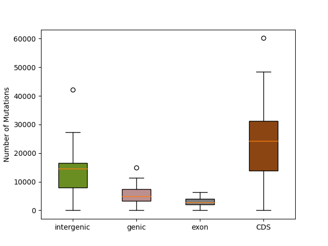
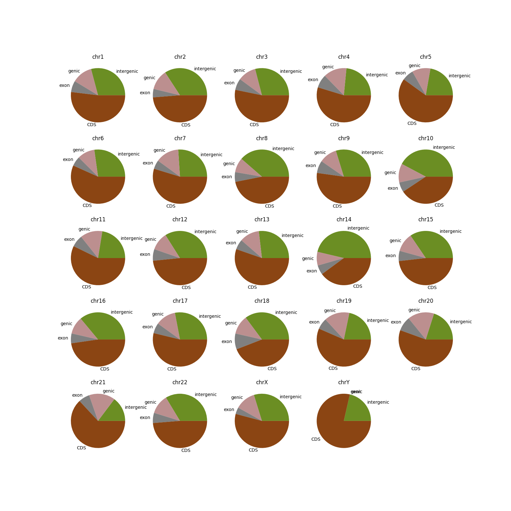

# Genomic Localization Of Mendelian Deseases

# Introduction
Mendelian diseases are hereditary conditions caused by mutations in a single gene and follow classic Mendelian inheritance patterns, such as autosomal dominant, autosomal recessive, or X-linked inheritance. These diseases can affect individuals of all ages and ethnic groups, and their impact can vary from relatively benign conditions to severe disorders that affect quality of life and can even be fatal. Among the most well-known Mendelian diseases are cystic fibrosis, Huntington's disease, hemophilia, and Duchenne muscular dystrophy [1, 2].

The precise identification of the genomic location of mutations associated with these diseases is crucial for understanding their pathogenesis, diagnosis, and treatment. Mutations can occur in different parts of the genome, such as exons, introns, or intergenic regions, and their position can have significant implications for gene expression and the function of the affected gene [4].

Exons are the coding regions of DNA that contain information for protein synthesis, while introns are non-coding segments that are removed during the processing of precursor messenger RNA (mRNA). Mutations in exons can alter the amino acid sequence of the encoded protein, resulting in structural or functional changes that contribute to disease development [3].

On the other hand, mutations in introns can affect mRNA splicing, the process by which introns are removed and exons are joined together to produce functional mature mRNA. Mutations that alter splicing can lead to the production of defective mRNA or the inclusion of aberrant exons, resulting in dysfunctional proteins that contribute to disease [3].

Mutations in intergenic regions, which are found between coding genes, can also play a role in the pathogenesis of Mendelian diseases by affecting gene expression regulation. These regions may contain regulatory elements such as promoters, enhancers, or transcription factor binding sites that are crucial for controlling gene activity [3].

Additionally, it is important to clarify the distinction between coding sequences (CDS) and genes. Genes represent functional units of heredity that encode specific instructions for synthesizing proteins or functional RNA molecules. Each gene encompasses not only coding regions, where protein-coding sequences are found, but also regulatory elements such as promoters, enhancers, and untranslated regions (UTRs), which govern gene expression and processing. In contrast, coding sequences (CDS) exclusively denote the segments within genes that directly encode the amino acid sequence of a protein. This means, all CDS are conformed by exons which in turn come from genes, but not all genes code for CDS [6]. 

The precise identification of the genomic location of mutations associated with Mendelian diseases has become more feasible thanks to advances in next-generation sequencing (NGS) technologies, bioinformatic analysis techniques and the available databases with information about mutations associated with different diseases. These tools enable the analysis of the human genome and facilitate the identification of mutations in patients with hereditary diseases.

Understanding the genomic location of mutations associated with Mendelian diseases is essential for unraveling their pathogenesis and developing more precise and effective diagnostic and treatment strategies. Due to the intricate nature of Mendelian diseases and the critical role that specific mutations play in their manifestation, our primary objective is to pinpoint the precise genomic locations of these known mutations, given the genomic context of mutations, the elucidation of genotype-phenotype correlations can valuable predictive information about disease severity, onset, and progression.

## Objectives
1. Determine the genomic location of mutations associated with known Mendelian diseases.
2. Assess the distribution of mutations between coding and non-coding regions.

# Results and Discussion
Most mutations that determine Mendelian diseases are located in protein coding sequences (CDS). With around 30,000 mutations on average per chromosome (Fig. 1), CDS mutations are the most common mutation. Forming approximately half of the mutations associated with Mendelian diseases found in each chromosome, except for chromosome Y, where the mutations located in this chromosome are almost entirely located in CDS regions (Fig. 2). This is surprising due to its repetitive sequence nature [5]. But still, its small size has to be taken into consideration. Although most of the mutations are found in CDS, there are only 33 CDS mutations (results/counts.tsv), which is not comparable to the ~30,000 mutations on average per gene. 

The second most common location for mutations related to Mendelian diseases are intergenic regions (Fig. 1). With an average of around 15,000 mutations per chromosome. Chromosome 14 has the most abundance of intergenic mutations, with about a third of the mutations occurring in these regions (Fig. 2). Chromosome 21 appears to have the smallest fraction of intergenic mutations. Finally, Chromosome Y has less than ¼ of mutations in intergenic regions, but it only has 9 mutations (results/counts.tsv).

Lastly, the least common region to find the mutations we are intrested in are genes and exons that code for functional RNAs. Genic regions have a mean of arround 5,000 mutations per chromosome, while exons have a mean of around 2,500 mutations per gene (Fig. 1). Chromosome Y has cero mutations in these regions, while the rest of the chromosomes have roughly the same fraction of mutations in these regions (Fig. 2). 

> Figure 1. Box plot for mutations related to Mendelian diseases per genomic region. Note that CDS imply they are exons, which means they are genes. The genes and exons are separate as described in methods.

> Figure 2. Pie plots for the abundange of mutations related to Mendelian diseases per genomic region per chromosome. As for Fig. 1, CDS, genes and exons apear separately because not all genes and exons code for CDS.

# Conclusion
Most mutations related to Mendelian diseases are located in coding sequences (CDS). This implies that the etiology resides in faulty proteins that impair the cell's or tissue's normal function, as seen in cystic fibrosis disease, where the cystic fibrosis transmembrane conductance regulator (CFTR) channel is impaired and does not function properly, thereby altering the consistency of mucus, which in turn damages the lungs and other organs [7]. Therefore, most Mendelian diseases are due to mutated proteins that are unable to fulfill a function directly linked to the symptoms of the disease.

The second most common genomic region to find mutations related to Mendelian diseases is intergenic regions. This means that gene regulation is impaired, rather than the function of the protein itself. Regulation is crucial for gene expression. While the coding sequence of a given protein could be perfect, if it cannot be expressed, it will not be able to carry out its function.

Lastly, mutations in genes that do not code for coding sequences (CDS) can also be linked to Mendelian diseases. Functional RNAs are also responsible for regulation, so mutations in them cause similar effects to mutations in intergenic regions. 

# Methods
In this study, mutation positions associated with various diseases and conditions were obtained from the ClinVar database. Specifically, mutations linked to Mendelian diseases were identified based on their correspondence to entries in the OMIM database. Additionally, genomic coordinates of coding regions were retrieved from the GeneCode database. Data preprocessing, including file cleaning, was conducted using bash scripting. Subsequently, the positions of Mendelian disease mutations were mapped to the corresponding genomic regions using Python 3.0.

For research purposes we separated mutation locations in gene, exon, CDS, and intergenic. It was done this way in order to be more specific, given that all CDS are exons that come from genes, but not all genes are protein coding sequences nor are mede up of just exons. So "gene" encompasses promoter regions and introns, "exon" refers to non-CDS exons.

# References
[1] Rahit, K. T. H., & Tarailo-Graovac, M. (2020). Genetic modifiers and rare mendelian disease. Genes, 11(3), 239.

[2] Chial, H. (2008). Mendelian genetics: patterns of inheritance and single-gene disorders. Nature Education, 1(1), 63.

[3] Jove. DNA and Chromosome Structure: Organization of Genes. https://app.jove.com/science-education/v/11528/organization-of-genes-introns-exons-regulatory-elements

[4] Li, C., Zhao, H., Liang, B., Wang, T., & Li, G. (2007). An alternative protocol for isolating the flanking sequences of a mutation. Euphytica, 154, 139-144. https://doi.org/10.1007/s10681-006-9279-0.

[5] Rhie, A., Nurk, S., Cechova, M. et al. The complete sequence of a human Y chromosome. Nature 621, 344–354 (2023). https://doi.org/10.1038/s41586-023-06457-y

[6] Uniprot. What are UniProtKB's criteria for defining a CDS as a protein?. https://www.uniprot.org/help/cds_protein_definition 

[7] NIH. (2023). What causes cystic fibrosis?. https://www.nhlbi.nih.gov/health/cystic-fibrosis/causes 

